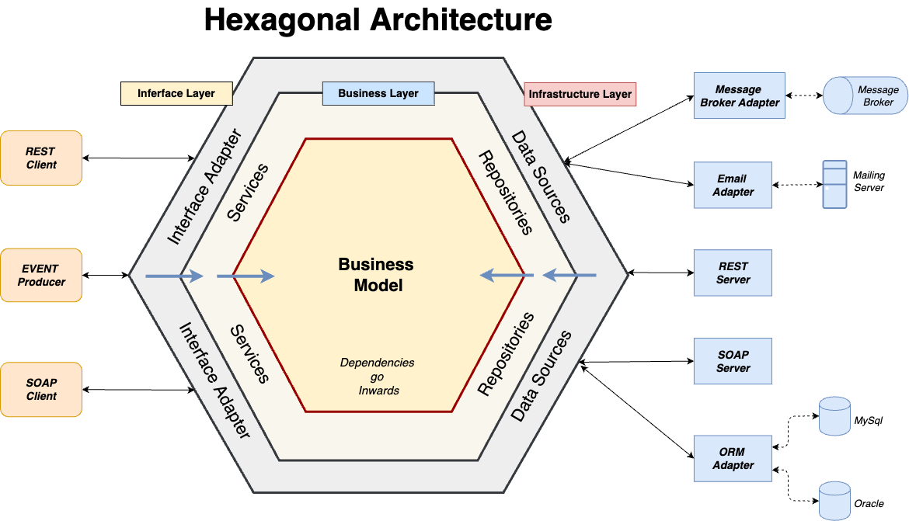
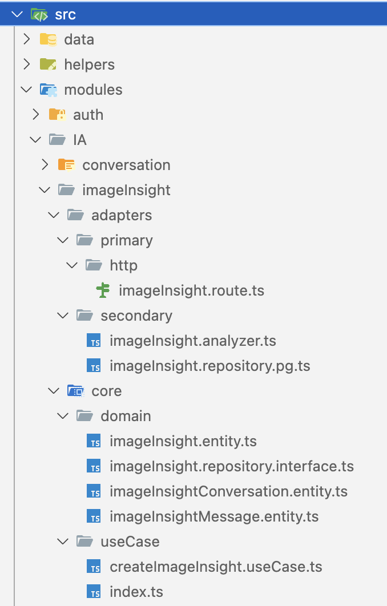

## 📄 Page de garde

**Nom et prénom** : Tim Moyence  
**École** : EPSI Bordeaux  
**Entreprise** : Projet personnel & missions freelance  
**Titre de la certification** : Développeur en Intelligence Artificielle et Data Science  
**Promotion** : 2024-2025  
**Responsable de formation** : [À compléter selon EPSI local]  
**Logos à insérer** : EPSI + Identité visuelle projet ou entreprise concernée

---

## 📚 Sommaire

_Généré automatiquement selon les parties du dossier._

---

## 📝 Introduction

Durant mon parcours en formation à EPSI Bordeaux et mes projets menés en autonomie, lors d'une précédente expérience en stage chez Geev, j’ai développé une expertise progressive dans les domaines de la Data Science, du Machine Learning et de l’ingénierie logicielle appliquée à l’intelligence artificielle.

Ce dossier professionnel vise à démontrer la diversité des compétences acquises à travers plusieurs projets concrets :

- Une plateforme prédictive épidémiologique alliant modélisation, API, visualisation et architecture cloud.
- Un assistant intelligent dédié à la médiation culturelle muséale.
- Un POC de modération automatisée d’images basé sur des capacités multi-modales d’IA générative.

À travers ces expériences, j’ai consolidé ma maîtrise des outils modernes de développement (FastAPI, AutoGluon, dbt, Metabase, Azure, LangChain, GPT, etc.), et appris à structurer des solutions robustes et explicables, tout en respectant les enjeux éthiques et les contraintes de mise en production.

Après quelques années de recherche de sens et de réorientation (une bac général, suivis d'un CAP en restauration, d'une année de fac de biologie) j'ai débuté une carrière dans le secteur du commerce, où j'ai travaillée dans un premier temps en tant que vendeur chez Leroy merlin, puis en tant que responsable de rayon chez Decathlon. Ces expériences m'ont permis de développer une forte culture client, un sens de l'organisation et une capacité à travailler en équipe et a manger celle ci.

Suite a un voyage dans les îles, j'ai pris conscience que je ne voulais plus continuer dans le secteur du commerce, mais chercher un metier qui me permettrait de sortir d'une zone de ocnfort et également de pouvoir travailler de manière autonome quelque soit l'endroit où je me trouve. L'envie d'apprendre et de decouvrir les dessous du numérique et la manière dont les outils, site, applicaitons etc.. sont construitent c'est ainsi que j'ai décidé de me réorienter vers le secteur du developpement. Après un bootcam de 6 mois avec l'ecole O'clock j'ai pu optenir un titre professionnel de développeur web et web mobile, ce qui m'a permis de découvrir les bases du web avec Javascript. J'ai ensuite entrepris 8 mois d'approfondissement de compétences en travaillant sur des projet personnels et en freelance, ce qui m'a permis d'acquérir un peu plus d'experience sur les outils et les technologies du secteur.

Aujourd'hui je reste passionnée par l'apprentissage des technologies numériques, l’impact de l’intelligence artificielle dans notre société, j’ai donc entrepris de finaliser ma reconversion en réalisation ce bachelor auprès de l'espi (ecole conjointe avec l'idrac ou j'ai fait mes trois première année de formation dans le commerce).
J’ai ainsi pu développer une approche pragmatique et orientée résultats, en intégrant les enjeux de l’accessibilité, de l’éthique et de la responsabilité dans mes projets. Mon objectif est de contribuer à des solutions innovantes qui répondent aux besoins réels des utilisateurs tout en respectant les valeurs humaines et sociétales.

Aujourd’hui, je m’inscris dans une dynamique d’innovation alliant IA, accessibilité et éthique, avec l’ambition de concevoir des outils intelligents, responsables et utiles pour la société. Mon profil hybride, à la croisée des soft skills managériales et des expertises techniques, me permet de comprendre les enjeux stratégiques tout en livrant des implémentations concrètes.

Mon projet professionnel s'articule autour de plusieurs axes. Le premier est un depart pour le Canada en octobre 2025. Pays dans lequel j'aimerais a partir du debut d'année 2026 avoir trouvé une entreprise me permettant de travailler en tant que manager ou lead dev. En effet, par mon cursus scolaire et mes experience en management, j'aimerais faire valoir mes compétences managériales et techniques dans un poste de lead dev ou manager technique. Je suis convaincu que mon profil hybride, alliant compétences techniques et managériales, me permettra de contribuer efficacement à des projets innovants et à fort impact.

Le deuxième axe est de continuer a developper un POC pour l'assistant intelligent dédié à la médiation culturelle muséale. En effet ce projet me tient particulièrement à cœur car il un réél besoin que je vie au quotidien et qui au fils des discusssion que j'ai pu avoir en présentant le proejt un besoin dont je ne suis pas le seul a partager. Je souhaite développer cet assistant intelligent pour améliorer l'expérience des visiteurs dans les musées, en leur offrant un accès facilité aux informations et aux ressources culturelles, rendant ainsi les musées accessible a tous.

---

## I. Environnement professionnel

### 1. Présentation de l’entreprise

J'ai été lors de cette année acceuillis pour mon alternance par l'entreprise Beecoming, entreprise créé en 2019 par deux frère et un amis d'enfance. Basé en charente maritime et spécialisé dans le développement de solutions numériques tournée vers l'industrie par le passé et les contacts des dirigeants L'entreprise compte une vingtaine de collaborateurs et se concentre sur la création d'applications web et mobiles.

**[Donner un peu plus de contexte sur l'entreprise, ses valeurs, sa mission et son positionnement dans le secteur de l'IA et de la Data Science. Mentionner les projets récents ou les innovations notables.]**

---

### 2. Beecoming et mon rôle

J'ai integrée beecoming en tant que développeur fullstack en alternance, avec pour mission de travailler sur un projet de gestion de chais. J'ai pu dans le cadre de cette alternance avoir le role de developpeur web, de developpeur mobile avec Ionic et de gestonnaire de projet. J'ai été en charge du role de product manager sur ce projet et lead dev pour une equipe de 3 personnes (moi compris). J'ai pu ainsi expérimenter la gestion de projet agile, la mise en place de sprints et la coordination d'équipe dans un contexte ou l'efficience etait primordiale.

J'ai également pu travailler sur la mise en place de l'architecture technique du projet, la gestion des versions. L'application developpé l'a été en C# pour la partie front et back end web, et en Ionic pour la partie mobile. J'ai également pu travailler sur la mise en place de l'API REST et la gestion des données avec une base de données postgres.

Des missions de developpement applicatif a base d'intelligence artificielle etait prévu, mais n'ont pas pu etre réalisées dans le cadre de cette alternance. Le manque de temps liée a mes différenytes missions, et la rapidité d'avancement du projet n'a pas permis de les intégrer a ce jour. Celle reste prévu pour la V2 du projet, cependant nous sommes encore sur la V1 qui doit sortir en septembre après un ans de developpement.

J'ai par ailleurs eu l'opportunité de travailler sur des projets dans le cadre des mes etudes avec l'EPSI mais également avant ma formation avec un POC réalisé chez Geev pendant 2 mois de stage entre avril et juin 2024.
Cela m'a permit de mettre en pratique la gestion de call API avec différentes IA par le biais de Langchain permettant le plug and play de différentes IA, ainsi que la gestion de la data avec des outils comme dbt et Metabase.
J'ai également pu travailler sur la mise en place des prémices d'un assistant intelligent dédié à la médiation culturelle muséale, projet qui me tient particulièrement à cœur.

## 3. Le projet de gestion de chais

Le projet de gestion de chais est un projet d'application, web et mobile, destinée à optimiser la gestion des chais pour les personnes travaillant dans le cognassé. Il permet de suivre grâce a trois modules :

- Vendanges
- Vinification
- Gestion de chais

De gérer les différentes étapes de la production du cognac, de la récolte des raisins à la mise en bouteille. L'application permet également de suivre les stocks, gérer les intrants, les numéros de DAE, les numéros de lots d'intrant, le suivis de la vinificaiton par l'ajout d'analyses et prise de mesures a des lots, gérer les stocks de vin. L'objectif final est a l'avenir de prendre en compte les données de la vigne a la mise en bouteille et de permettre une traçabilité complète du processus de production avec gestion de saisis douanière.

L'application est développée en C# utilissant le framework ASP.NET Core Blazor pour la partie web (front et back), l'avantage de cette technologie et ce framework est la mise en place d'un environnement de communication unifié ou aucune route n'est necessaire pour la mise en place d'une communication front et back. En effet, blazor aspire créer un websocket qui permet une connection instantannée et plus fluide au sein de l'application.

---

### Architecture FRONT et BACK :

MVVM : Modèle View View Model

DTO / Data
↓
ServiceBack
↓
InterfaceBack
↓
ServiceUIFront
↓
InterfaceUIFront
↓
Front (Blazor)

L’architecture que tu décris est une architecture en couches (layered architecture), avec une séparation stricte des responsabilités entre la couche de données, les services backend, les interfaces de service, et la partie frontend (Blazor). Plus précisément, cela s’approche fortement d’un pattern DDD inspiré (Domain-Driven Design) combiné à une architecture en oignon (Onion Architecture), adaptée à un projet client/serveur (Blazor Server ou WebAssembly + API).

Voici ce que représente chaque couche :

🔹 1. DTO / Data
Type : Modèle de transfert de données
Responsabilité : Transférer les données entre couches sans logique métier (ex: BatchDTOCreate)
Remarque : Utilisé pour découpler le modèle de domaine du frontend et pour la sérialisation/désérialisation JSON
🔹 2. ServiceBack
Type : Service métier (couche Application)
Responsabilité : Gérer la logique métier côté serveur (ex: créer un lot, vérifier des contraintes)
Exemple : NewBatchService : INewBatchService
🔹 3. InterfaceBack
Type : Interface d’abstraction pour les services backend
Responsabilité : Permet l’injection de dépendances, facilite les tests et le découplage
But : Permet de moquer les services dans les tests unitaires, respecter l’inversion de dépendance
🔹 4. ServiceUIFront
Type : Service d’orchestration Blazor côté client
Responsabilité : Appeler les services backend (via HttpClient), gérer l’état UI local, effectuer de l’aggrégation
Exemple : NewBatchUIService : INewBatchUIService
🔹 5. InterfaceUIFront
Type : Interface de service frontend
Responsabilité : Même principe que InterfaceBack, pour permettre l'injection dans les composants Blazor
But : Testabilité, lisibilité, séparation des préoccupations
🔹 6. Front (Blazor)
Type : Composants UI (Razor)
Responsabilité : Affichage et interaction utilisateur, logique de présentation
Exemple : NewBatch.razor
🏗️ Type global d’architecture
Cela peut être résumé comme :

Architecture en couches découplées avec interfaces, inspirée de Clean Architecture ou Onion Architecture, adaptée à un front Blazor.

---

Concernant la partie mobile, des routes on été mises en place coté blazor pour permettre d'avoir accès a la partie minimaliste de l'application. L'objectif de l'application mobile etant de pouvoir saisir et consulter rapidement les données des cuves, vendanges et autres.. Elle a été développée avec Ionic, permettant une application cross-platform.

La base de données utilisée est PostgreSQL, avec une architecture orientée microservices pour faciliter l'évolutivité et la maintenance.

[base de données diagram](GestionChais.png)

### Acteurs internes/externes

J'ai pu gérer ce projet en tant que developpeur et product manager d'une equipe de 3. Nous avons réalisé dans la mesure du possible avec nos alternance respective une gestion de projet SCRUM par des reunion matinal de scrum, la tenu d'un Jira ou j'ai pu réaliser les user story et les tickets en liens avec les figma et le designers de l'entreprise. Des testes de grooming par poker planning, puis finalement par identification par collaborateur. Nous avons également mis en place dans un premier temps des reunion splus eparces puis rassemblé les sprint plannings, sprint review et groming sur la meme demi journée, permettant de terminer et lancer un sprint dans les meilleures conditions.
Celle ci etait lancé en milieu de semaine pour eviter la mise en production en fin de semaine.

Un clients référents étant présent lors de chacune des reunions, pour permettre la liaison entre les clients finaux potentiels et l'equipe de dev. Cela a permis d'avoir accès a des cas métiers.

En prenant du recul sur ce projet, la double casquette PM et developpeur a été une belle experience pour découvrir les deux métiers, voir meme prendre en compte le role de scrum master. Cependant la quantité de missions et la régularité de chacune a été difficile a réaliser de manière peirenne et des actions mises en place pouvait se perdre lors de moment de cours, ou simplement par les moments de charge de travail plus important.

Ainsi si cela avait été a refaire une augmentation de la rigueur de travail par une plannification des taches que j'ai pu maintenant connaitre en gestion de projet informatique permettrait un meilleur suivis des uses cases et du cas clients pouvant, comme dans chaque projet, etre changeant.

---

## II. Projet personnel

---

N'ayant pas eu la chance d'avancer assez vite par rapport a la road map fixé en début de projet et avec des changements de modules / architecturaux importants, je n'ai pas eu l'opportunité de réaliser les missions d'intelligence artificielle prévues dans le cadre de mon alternance. Par ailleurs, j'ai pu travailler sur des projets personnels qui m'ont permis de développer mes compétences en IA et Data Science.

Trois projets m'ont permit de developper des compétences en intelligence artificiel. En partant de la consommation des API donnée par les grands groupes a la réalisation de l'entrainement d'une IA de prédiction.

Le premier est celui qui m'a donnée encore plus de ferveur d'apprendre a utiliser et faire fonctionner une intelligence artificelle.

### 🧪 Projet 1 – POC de modération d’image via IA (ChatGPT + Vision) – Cas GEEV

Celui ci a comencé lors d'une discussion a la fin de mon début de reconversation lors d'une des non-conférences organisées par l'associatiion bordelaise Okiwi.
Non-conférences ou j'ai pu discuter avec Alexandre CTO de Geev, et echanger avec lui sur l'IA, j'ai été etonnament surpris de l'avis de quelques developpeurs sur leurs non utilisation (c'etait en 2024 donc moins embarqué encore qu'aujourd'hui) voir leurs réticence. Et lui a été surpris de mes connaissance et mon envie d'apprendre.

Nous avons beaucoup échangé lors de la conférence. Puis ensuite echangé pendant quelques semaines avant de décider conjointement que je réaliserais un stage de deux mois chez eux pour me permettre d'apprendre et eux de tester differents uses cases.

Avec mon passé dans le commerce et en tant que manager. J'ai eu une double casquette.

La première de developper un poc pour deux sujets. Le premier la mise en place de test pour la discussions et prise de rendez vous automatisé pour les personnes voulant donner un objet. Le deuxième sur la modérations par le biais des photos.

La deuxième casquette était sur des sujets plus humains comme la mise en place d'une phase de recherche sur l'utilisation de l'IA par les différents métiers de l'entreprise et comment l'integrer dans leurs metiers. Mais également sur la transmission de connaissance sur les normes RGPD et IA act.

Pour la réalisation du premier POC j'ai réalisé rapidement une interface de discussion front, avant de passer pour plus de scalabilité a des testes avec l'aide de Jest, le back de test a été développé en node Typescript avec Langchain. Framework permettant le plug and play de différentes IA. En effet ce framework aujourd'hui beaucoup plus en vogue, était utilisé dans un premier temps en 2024 pour faire du chainage de prompt, permettre d'une certaine mémoire.
J'ai ainsi pour développer un assistant d'IA qui utilisait quelque peut les principes des agents aujourd'hui. En effet a ce jours un agent permet de faire passer a des IA plus spécifique ou a la memem IA mais avec des prompts spécifiques, voir des IA ayant reçu des entrainements ou RAG spécifique. Ainsi j'avais un agent qui réalisait une extraction a partir du texte et de l'historique de la discussion. En fonction de la demande de l'utilisateur l'objectif etait d'avoir un mot en réponse spécifique, ce mot permettait d'envoyer la discussion vers une autre IA qui allais elle répondre ou chercher de l'information. Cela permettait d'eviter les fuite de mémoire, les prompts trops long etc..

Le deuxième est la modération par IA pour l'acceptation de création d'annonce. Le besoin etait d'eviter a la personnes faisant la modération d'avoir a la réaliser a la main sur 45% des annonces mais plutot de réaliser cela sur les alerte levé par l'IA.
Le teste a été concluent, réalisé également avec Jest pour l'envoie de photo attendants une réponse particulière.
Pour ce poc un simple prompt de vérification selon les CGU permettait de faire en sorte de filtrer plus de 90% des photos qui n'aurait pas du se retrouver sur le site. Le modèle GPT vision etant le meilleur dans ce traitement car entrainé a l'epoque sur une grande quantité de photo et video c'etait celui permettant l'absorption de la plus grande volumétrie de requete, pour les autre IA tels que Gemmini, le chat ou Deepsek des timout etait attribué au bout de 10 requetes envoyé en meme temps, et le retour n'etait pas de la meme qualité que GPT.

Sur cet exemple, avec le temps qu'il me restait sur le stage, nous avons fait le choix de tester la création d'annonce a partir d'IA. Test concluent également a 90%, en effet l'IA d'open AI n'etait pas capable a chaque iteration de reconnaitre par exemple une boucle de cheveux avec un chien. L'objectif ici etait de tester l'IA vision, comparer et vérifier les coup en production par rapport au nombre d'annonce produite par jours. Et la manière de monétiser cette fonctionalité. Finalement le projet, trop honnereux pour le moment a été abandonnée.

### 🤖 Projet 2 – Assistant IA muséal interactif (LangChain + GPT vision + TTS)

Suite à ce projet où j'ai pu expérimenter l'IA et la force du framework d'abstraction LangChain, j'ai réalisé un voyage à Paris de quelque jours, voyage durant lequel j'ai pris le temps de visiter le musée du Louvre. Amateur d'art mais avec une connaissance très faible, j'ai pris le parti de faire un test avec ChatGPT dans leur application, en utilisant un prompt simple, quelques noms d'artistes, et l'envoi de photos d’œuvres.

Ce test concluant m'a permis, grâce au pouvoir de l'entrainement massif de chat GPT 4 sur des millions de data et à la richesse d’Internet en matière de contenu culturel, de prendre encore plus de plaisir dans ma visite. J’ai pu personnaliser entièrement mon propre parcours de visite en choisissant les tableaux qui m’attiraient, en apprenant à mon rythme, et même en vivant une sorte de mini chasse au trésor organisée par l’IA : celle-ci me proposait de retrouver des œuvres à partir de description qu’elle-même me formulait.

À la suite de cette expérience, l’idée d’une application dédiée a émergé. J’ai d’abord développé une première version backend pour tester le concept, puis mis en œuvre une première version fonctionnelle en équipe, encore en cours de développement à ce jour.

### Architecture technique

J'ai ainsi pu déployer une architecture technique moderne, modulaire et maintenable, pensée pour répondre aux exigences d’un système embarquant de l’intelligence artificielle tout en restant fluide et accessible pour un large public.

J'ai dans un premier temps monté un conteneur docker contenant le back end. Celui ci avec une architecture hexagonale pour un système robuste et évolutif.

Le socle applicatif a été conçu avec Node.js, le framework Express, et une surcouche permettant un développement en TypeScript.

L’ensemble est organisé selon une architecture hexagonale, aussi appelée architecture en oignon.

Dans les explication de Luis Soares qui explique cette architecture suite a la création de celle ci par Alistair Cockburn dans les années 2000. Cette indépendance garantit une forte cohésion du code métier et une facilité de test unitaire.
Selon Luis Soares, l’architecture hexagonale est un modèle d’architecture logicielle qui vise à séparer la logique métier de l’application des détails techniques et des interactions avec le monde extérieur. Elle repose sur les concepts de Ports et d’Adaptateurs, permettant ainsi une flexibilité et une maintenabilité accrues.

Le modèle de domaine (Domain Model)

Coeur de l’architecture, il incarne la logique métier principale de l’application. Regroupe les entités, les règles métier et les comportements fondamentaux, indépendamment de toute technologie extérieure (base de données, interface utilisateur, réseau, etc.). Cette indépendance garantit une forte cohésion du code métier et une facilité de test unitaire.

Les Ports :

Ils définissent les points de communication entre la logique métier et le monde extérieur. Il existe deux types de ports :

- Ports primaires : ce sont les interfaces que l’application expose vers l’extérieur. Ils traduisent les cas d’usage que les utilisateurs ou systèmes peuvent déclencher (par exemple via une API REST ou une interface mobile).
- Ports secondaires : ce sont les interfaces dont la logique métier dépend pour interagir avec des services extérieurs (bases de données, systèmes tiers, etc.). Ils définissent ce que l’application attend d’un composant technique.

Les Adaptateurs

Les adaptateurs implémentent concrètement les ports pour établir la connexion entre la logique métier et l’environnement technique. Eux aussi se divisent en deux catégories :

- Adaptateurs primaires : ils traduisent les entrées provenant de l’extérieur (requêtes HTTP, actions utilisateur, etc.) en appels aux cas d’usage internes.
- Adaptateurs secondaires : ils fournissent l’implémentation des services attendus par les ports secondaires (accès aux données, appel à une API externe, etc.).

J'ai reproduit l'architecture hexagonale a partir de ce que j'avais appris par le biais de Geev dont voici un exemple concret de cette architecture dans le projet, appliquée au module de traitement des images (imageInsight) :

La structure est ainsi divisée en deux grandes couches principales :

**Couche Core** qui est le coeur logique du métier :
Elle regroupe les entités métier, les interfaces (ports) et les cas d’usage. Dans notre projet, cela correspond aux éléments suivants :

le dossier domain/ comprenant les fichiers suivants :

- imageInsight.entity.ts : représente une œuvre ou une analyse effectuée à partir d’une image. Cette entité encapsule les règles métier comme la validation ou la génération d’identifiants.
- imageInsightConversation.entity.ts : modélise une session ou un échange, souvent liée à un utilisateur ou à un parcours de visite. Sert à l'ORM pour builder la base de données.
- imageInsightMessage.entity.ts : structure les messages échangés lors de l’analyse, que ce soit une question, une réponse IA ou une interaction intermédiaire. Sert à l'ORM pour builder la base de données.
- imageInsight.repository.interface.ts : interface définissant les contrats d’accès aux données pour la persistance. Ce port secondaire est injecté dans les cas d’usage pour garantir l’indépendance vis-à-vis de la technologie de stockage.

le dossier useCase/ comprenant les fichiers suivants :

- createImageInsight.useCase.ts : contient la logique applicative nécessaire à la création d’un insight (analyse d’image). Il coordonne les appels entre les entités, les services d’analyse (ex : IA), et les persistances. Ce cas d’usage ne connaît ni Express, ni PostgreSQL, ni TypeORM : il est 100 % indépendant.
- index.ts : point d’entrée pour l’injection des dépendances et l’agrégation des cas d’usage.

**Couche Adapters** qui est l’interface avec le monde extérieur

Cette couche adapte les appels extérieurs (ou drivers comme vu au dessus) à la logique métier. Elle est divisée entre :

le dossier adapters/primary/http

- imageInsight.route.ts : cette route Express sert d’entrée HTTP. Elle reçoit les requêtes (comme l’upload d’image), appelle les cas d’usage via le service approprié, puis retourne la réponse au format JSON. Cette couche peut être remplacée par une API GraphQL ou un CLI sans impacter la logique métier. Elle contient également les commentaire du swagger permettant de documenter l'API.

le dossier adapters/secondary/

- imageInsight.analyzer.ts : cet adaptateur secondaire joue le rôle de passerelle vers l’IA. Il encapsule l’appel à LangChain et donc OpenAI, permettant d’obtenir une analyse visuelle ou contextuelle d’une œuvre. Dans un premier temps c'est elle qui contient également le prompt de base pour l'analyse de l'image.
- imageInsight.repository.pg.ts : implémentation de l’interface de persistance avec TypeORM et PostgreSQL. Ce fichier interagit directement avec la base, tout en respectant les interfaces définies dans domain.

Le grand avantage de cette architecture est l’inversion des dépendances : ce sont les adaptateurs secondaires qui dépendent du cœur métier, jamais l’inverse. Concrètement, cela signifie que l’on peut remplacer une base PostgreSQL par une base MongoDB, ou une IA OpenAI par une IA locale, sans modifier les cas d’usage.

### Intégration de l’intelligence artificielle avec LangChain et GPT-4 Vision

Comme vu au dessus l'application repose sur une architecture permettant d'etre scalable et modulaire. Mais l'utilisation du Framework Langchain, permet de faciliter la création de chaînes d’interactions entre l’utilisateur et un modèle de langage (LLM). Il permet notamment de gérer la mémoire conversationnelle, le chaînage d’outils, de prompt, l'ajout de texte paramétré, la répartition des tâches entre plusieurs modules IA, ou encore l’analyse sémantique enrichie.

Les modules IA implémentés incluent :

- Analyse d’image : grâce à GPT-4 Vision, les œuvres envoyées sont analysées. L’IA peut identifier des éléments visuels, des styles, des émotions, et même proposer des liens avec d’autres œuvres ou artistes, car son prompt est enrichie et lui permet de comprendre le contexte culturel ainsi que la localisation de l'oeuvre.
- Réponses culturelles personnalisées : chaque interaction est enrichie avec des anecdotes, des références historiques, ou des liens vers d’autres œuvres similaires, afin de créer une expérience de visite augmentée.
- Mémoire de la discussion : L'application garde en mémoire les œuvres déjà explorées, les thèmes abordés, ou les préférences exprimées, ce qui permet de construire d'intégrer dans les prompt à l'avenir toutes ses métriques et ainsi d'avoir un véritable parcours d’exploration sur mesure pour chaque utilisateur.

📌 Capture d'écran du prompt et d'un test ?

⸻

### Base de données : persistance fiable avec PostgreSQL + TypeORM

Comme indiqué au dessus, les conversations, les messages, la gestion utilisateur sont stockées dans une base PostgreSQL, intégrée dans un conteneur Docker dédié. Cette base contient :

- Les utilisateurs (authentification)
- Les conversations et messages

L’usage de TypeORM permet de maintenir un bon niveau d’abstraction vis-à-vis du schéma de la base, facilitant les migrations et les évolutions du modèle de données sans rompre la logique applicative existante.

⸻

# J'EN SUIS LA

---

### Conteneurisation avec Docker : portabilité et déploiement autonome

Pour garantir un déploiement stable et reproductible, toute l’architecture backend a été conteneurisée avec Docker. Cela permet de :

- Isoler les composants : backend, base de données, services tiers,
- Faciliter les tests et la mise en production,
- Déployer rapidement sur tout type d’infrastructure, sans dépendance forte à un cloud spécifique.

L’ensemble du projet est hébergé sur un serveur VPS OVH, configuré pour supporter les différentes charges applicatives, gérer les logs, et permettre des déploiements itératifs à l’aide de d≥ocker-compose.

📌 [Schéma suggéré : stack technique conteneurisée avec Backend + PostgreSQL + Nginx (facultatif)]

⸻

### Frontend mobile

Pour l’interface utilisateur, nous avons opté pour React Native avec TypeScript, en utilisant le Framework Expo. L'objectif est de produire une application mobile cross-platform performante, tout en assurant une cohérence du design, une rapidité de developpement multi plateform permettant de réaliser un POC rapidement.

Les écrans déjà fonctionnels à ce jour comprennent :

- Une page d’accueil avec authentification
- Un tableau de bord centralisant les conversations passées
- Une interface de chat enrichie, avec aperçu en direct des images d’œuvres envoyées
- Une navigation thématique via des tags, permettant à l’utilisateur d’explorer des courants ou des thématiques précises : Renaissance, couleurs, émotions, artistes féminines, etc.

Le tout est stylisé avec Tailwind CSS, adapté à React Native, pour assurer un rendu esthétique cohérent, moderne et surtout ergonomique sur mobile.

📌 [Capture suggérée : aperçu de l’écran de chat avec un visuel d’œuvre et une réponse IA]

⸻

### Conclusion : Vers une médiation culturelle augmentée

Ce projet est né d’une simple expérience personnelle et s’est mué en un véritable assistant intelligent au service de la médiation culturelle. Il repose sur une approche technique solide et moderne, couplée à une utilisation stratégique de l’intelligence artificielle générative. Son potentiel d’évolution est vaste : ajout de synthèse vocale (TTS), intégration de parcours géolocalisés dans les musées, ou encore enrichissement collaboratif des données culturelles.

Plus qu’un projet technique, c’est une expérience sensible, un moyen de réenchanter la visite culturelle pour tous, à son propre rythme, avec une technologie qui s’efface pour laisser place à la découverte.
